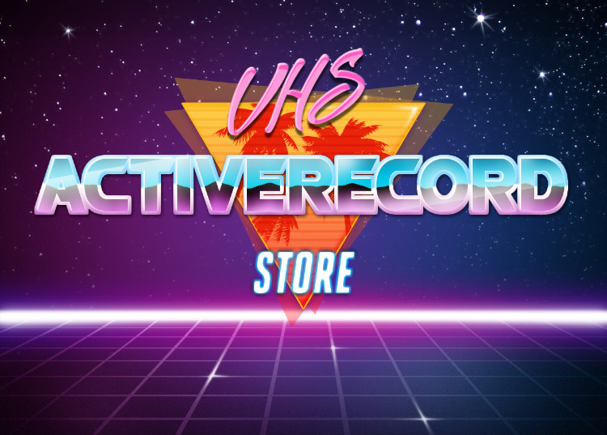
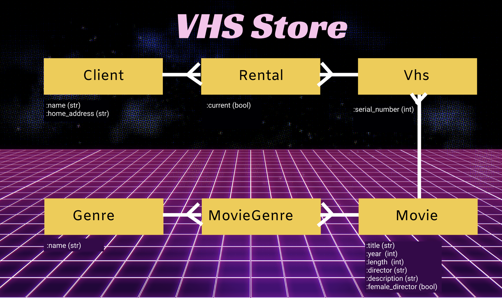

# ActiveRecord VHS Store



Welcome to your good old neighborhood VHS store. You will build an app that tracks the store inventory, the rentals and the clients. Prepare  for the 80s nostalgia.

---

## Associations

You will be working on a six-model domain: `Client`, `Rental`, `Vhs`, `Movie`, `MovieGenre`, `Genre`. The associations are as follows:
- Genre has many movie_genres and movies through movie_genres,
- MovieGenre belongs to a movie and a genre,
- Movie has many movie_genres and genres through movie_genres,
- Movie has many vhs and rentals through vhs,
- Vhs belongs to a movie,
- Vhs has many rentals and clients through rentals,
- Rental belongs to a client and vhs,
- Client has many rentals and vhs through rentals.

--- 

## ERD

**NOTE** that the below ERD does not include foreign keys -- these you need to add on your own, together with the association macros. 

```
  Client 
    |
    ^
  Rental                  
    V
    |
    |
  Vhs >---- Movie ----< MovieGenre >---- Genre
```



--- 

## Getting Started

1. Carefully read the readme.
2. Fork and clone this lab.
3. Run `bundle`.
4. Check the code you have been given: see `app/models` and files in it (is there a class for every model? are all the associations set up?), see `db/schema`, see `rb/seeds.rb`. Run `rake db:migrate:status` to see if there are any pending migrations -- if there are, check these files and see if you need to add anything before migrating it.

**NOTE ABOUT THE SEEDS**: the `seed`s have been commented out -- uncomment it once you've built out your migrations and associations.Also, as you can see in the file, `seed`s rely on a significant amount of randomness so if you work with another person and do not share the same database, you WILL get different results in terms of number of associated instances or number of instances in general.

5. Now that you know what is missing, DO NOT CODE JUST YET. Discuss with your partner the plan for the setup: what are you going to do step by step and how are you going to test if it worked. 
6. You must have noticed that one of the models is called `Vhs`. In `rake console` run:
```ruby
'vhs'.pluralize
'vhs'.singularize
```
As you see, ActiveRecord perceives this word as already pluralized and it will pose problems when you're trying to apply `.vhs` method on e.g. a `Movie` instance (AR will look for a singularized model of `Vh`). To prevent this, let's tell AR that this word is the same singular as plural -- paste this in `config/environment.rb`:
```ruby
ActiveSupport::Inflector.inflections do |inflect|
  inflect.irregular 'vhs', 'vhs'
end
```
7. Run `rake -T` and see what process reminder tasks are available to you (they are marked with "🎁").
8. Start coding the setup. Test your code frequently.
9. After all your models are hooked up correctly, choose **minimum** five deliverables from the list below. You need to have at least one deliverable for each of the CRUD actions. The only compulsory deliverable is `Client.paid_most` (it's a READ action). The deliverables marked with "⭐️" require a bit more of pseudocoding and `binding.pry`.
10. After you've chosen the deliverables, tackle one by one. Majority of them require helper methods (yes, plural), the use of `binding.pry`, and a good amount of pseudocoding. When writing helper methods, please remember that:
- each method should do JUST ONE JOB,
- each method name should be descriptive,
- it's always best think about where the method should live; for instance: is it a behavior of a Client? or is it a behavior of a Vhs instance and should be called from within an instance method of a Client?

**NOTE**: all deliverables will make you a strong dev and will allow you for a good practice on ActiveRecord. Please spend some time on this lab, together with your partner or on your own. This lab can also be developed into a CLI that can serve as a strong portfolio piece or blog post material. Check out Danny Sasse's blog post on how his pairing partner and he [implemented DRY solution](https://dsasse07.medium.com/abstracting-refactoring-in-ruby-with-send-97e6ef1a4661).

--- 

## Functionality

Build the following functionality:

### `Rental`
**READ**
- `Rental#due_date` - returns a date one week from when the record was created
- `Rental.past_due_date` - returns a list of all the rentals past due date, currently rented or rented in the past

### `Client`
**CREATE**
- `Client.first_rental` - accepts and instance of arguments needed to create a new `Client` instance and a currently available `Vhs` instance (or, more difficult: a `Movie` instance or just a `Movie` title and on that basis chooses a currently available vhs); it creates a new `Client` instance and a new `Rental` instance with `current` set to true.


**READ**
- `Client.most_active` - returns a list of top 5 most active clients (i.e. those who had the most non-current / returned rentals)
- `Client#favorite_genre` ⭐️ - `puts` the name of the genre that the client rented the most; in counting how many times a person watched a genre, you can treat two rentals of the same movie as two separate instances;
- `Client.non_grata` - returns a list of all the clients who have a vhs past the due date (or, more difficult: who ever missed the return date)
- `Client.paid_most` - returns an instance who has spent most money at the store; one rental is $5,35 upfront (bonus: additional $12 charge for every late return — do not count those that have not yet been returned) 
- `Client.total_watch_time` - returns an Integer of all movies watched by the all clients combined (assume that a rented movie is a watched movie)


**UPDATE**
- `Client#return_one` - accepts an argument of an vhs instance, finds the corresponding rental and updates the rental's `current` attribute from `true` to `false`
- `Client#return_all`- updates `current` attribute from `true` to `false` on all client's rentals 


**UPDATE AND DELETE**
- `Client#last_return` - updates all Client' rentals current to `false` and deletes the Client from the database

### `Vhs`
**CREATE**
- `Vhs.hot_from_the_press` - accepts arguments used to create a new instance of a `Movie` and a name of a genre; creates the movie, associates it with appropriate genre (if it exists, if it doesn't - creates one) and creates three instances of a `Vhs` associated with that Movie


**READ**
- `Vhs.most_used` - prints a list of 3 vhs that have been most rented in the format: "serial number: 1111111 | title: 'movie title'
- `Vhs.all_genres` - returns a list of all genres available at the store
- `Vhs.available_now` - returns a list of all vhs currently available at the store

### `Movie`
**READ**
- `Movie.available_now` - returns a list of all movies currently available at the store
- `Movie.most_clients` ⭐️ - returns an instance of `Movie` that has been rentes by the most people
- `Movie.most_rentals` - returns a list of TOP3 All Time favorites based on number of rentals
- `Movie.most_popular_female_director` - returns a string that's a name of a director of the movie made by a female director with most `Rental`s
- `Movie.newest_first` - returns a list of all the movies from the most recent ones to the oldies but goldies based on the release year
- `Movie.longest` - returns a list of the movies from the longest to the shortest
- `Movie#recommendation` - prints a recommendation that includes a random emoji next to the title, and in new lines: the movie description, its length, director and year of release
- `Movie.surprise_me` - prints a recommendation for a random movie


**DELETE**
- `Movie#report_stolen` - deletes a random vhs instance associated with this movie that's currently not rented out and prints information: "THANK YOU FOR YOUR REPORT. WE WILL LAUNCH AN INVESTIGATION."

### `Genre`
**READ**
- `Genre.most_popular` - returns a list of 5 most popular genres based on number of movies
- `Genre.longest_movies` - returns a genre whose movies length average is the highest (remember to also test it with an instance of a Genre that does not have any movies associated)

---

## Contributing

Did you find a bug? A typo? Do you have an idea for a new hot deliverable? Please [create an issue](https://github.com/sylwiavargas/ActiveRecord-VHS-Store/issues) describing what change you'd like to see and whether you'd like to code it. Wait for my response and if it's a 👍, go ahead: fork the repo, write code and open a PR with a description of changes. 

✨ Shoutout to [Danny Sasse](https://github.com/sylwiavargas/ActiveRecord-VHS-Store) for finding a squishing a bug in seeds! 
